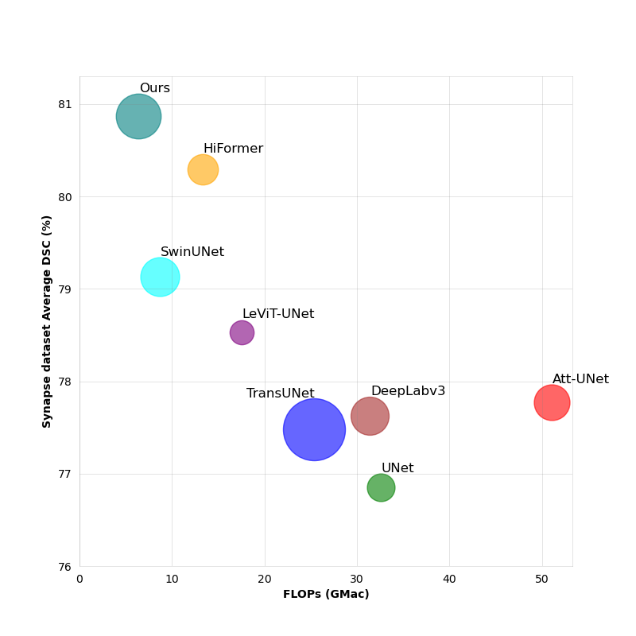

# EViT-Unet: U-Net Like Efficient Vision Transformer for Medical Image Segmentation on Mobile and Edge Devices

*Xin Li, Wenhui Zhu, Xuanzhao Dong, Oana M. Dumitrascu, Yalin Wang*

Code for the paper: [arXiv](https://arxiv.org/abs/2410.15036)

### Abstract

> With the rapid development of deep learning, CNN-based U-shaped networks have succeeded in medical image segmentation and are widely applied for various tasks. However, their limitations in capturing global features hinder their performance in complex segmentation tasks. The rise of Vision Transformer (ViT) has effectively compensated for this deficiency of CNNs and promoted the application of ViT-based U-networks in medical image segmentation. However, the high computational demands of ViT make it unsuitable for many medical devices and mobile platforms with limited resources, restricting its deployment on resource-constrained and edge devices. To address this, we propose EViT-UNet, an efficient ViT-based segmentation network that reduces computational complexity while maintaining accuracy, making it ideal for resource-constrained medical devices. EViT-UNet is built on a U-shaped architecture, comprising an encoder, decoder, bottleneck layer, and skip connections, combining convolutional operations with self-attention mechanisms to optimize efficiency. Experimental results demonstrate that EViT-UNet achieves high accuracy in medical image segmentation while significantly reducing computational complexity.



Comparison of model size, FLOPs, and performance (Dice on Synapse dataset). The area of each circle is propor- tional to the number of parameters (model size).


### Prerequisites

1. Clone the repo to your local:

```bash
git clone https://github.com/Retinal-Research/EVIT-UNET.git
```


2. We use [Python 3.10.15](https://www.python.org) and [Pytorch 2.0.1](https://pytorch.org). Build the virtual enviroment with ```conda``` 

```
conda env create -f environment.yml
```


### Data preparation

Synapse dataset is used in our paper. [Download](https://paperswithcode.com/sota/medical-image-segmentation-on-synapse-multi)

